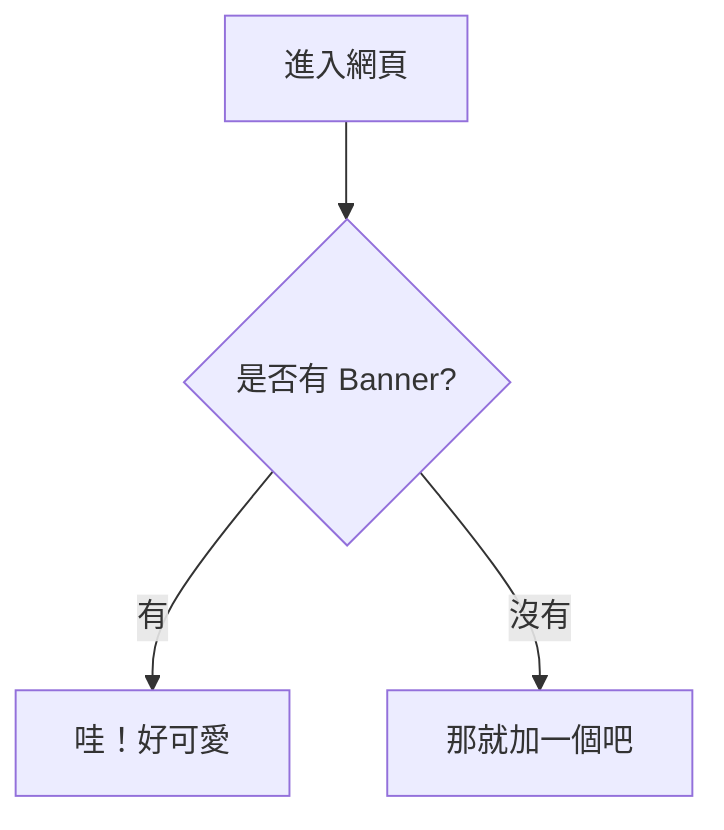

這是一篇用來測試 **Chirpy 主題** 所有內建元素的頁面。

## 1. 各級標題測試 (Headings)

以下展示 H2 到 H6 的樣式，請觀察 H2 是否有粉紅色的側邊條：

## 這是 H2 大標題 (帶側邊條)
### 這是 H3 子標題
#### 這是 H4 標題
##### 這是 H5 標題
###### 這是 H6 標題

---

## 2. 文字樣式 (Text Styles)

測試內文的 **加粗 (Bold)**、*斜體 (Italic)*、~~刪除線 (Strikethrough)~~、以及 `行內代碼 (Inline Code)`。

> **資管系筆記**：這是一段引用文字 (Blockquote)。請檢查左側的引用線顏色是否符合設計。

---

## 3. 圖片測試 (Images)

測試圖片的大小調整、對齊與陰影效果：

{: w="700" h="227" .shadow }
_圖片說明：這是一張帶有陰影效果並調整過寬高的 Banner (700x227)_

---

## 4. 列表與任務 (Lists & Tasks)

- [x] 完成粉紅 CSS 改造
- [x] 設定 Zen Maru Gothic 圓潤字體
- [ ] 撰寫第一篇正式文章

1. 第一步：學習 Markdown
2. 第二步：修改主題
3. 第三步：上傳到 GitHub

---

## 5. 提示框測試 (Prompts)

Chirpy 內建了四種提示框，請檢查標題顏色與圖示：

{: .prompt-info }
> **訊息提示**：這是一個普通的資訊框。

{: .prompt-tip }
> **小技巧**：這是建議使用的提示框。

{: .prompt-warning }
> **警告**：這是需要注意的黃色警告框。

{: .prompt-danger }
> **危險**：這是代表嚴重錯誤的紅色危險框。

---

## 6. 代碼塊測試 (Code Blocks)

測試語法高亮與檔名顯示：

```scss
/* jekyll-theme-chirpy.scss */
body {
  font-family: "Zen Maru Gothic", sans-serif !important;
  background-color: #fff8fb !important;
}
```



